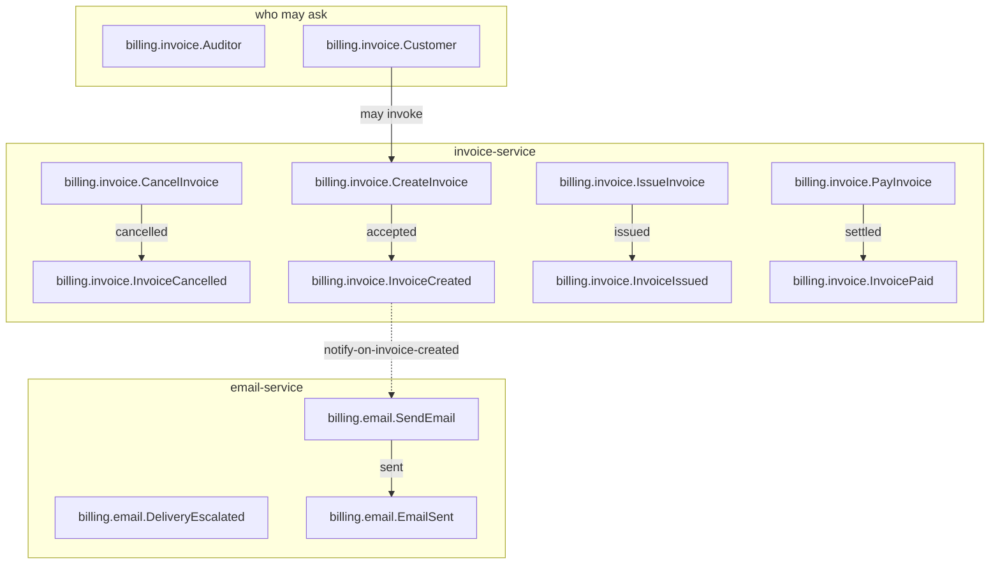

<!--
generated from billing v3
model digest 13577b3ce695932e980d418d5863bcde07f4c362516d53147870d31eaf2ed861
compiler 0.1.0 · generator 0.1.0
do not edit: regenerate with `protocol ess generate`
-->

# billing v3

Invoicing and the notification that follows it: the smallest system that still exercises every construct the model has — two bounded contexts, a command that can be refused, a command with an outcome its input cannot decide, both consistency levels, a state machine, actors, and a type of every kind.

## The system as a graph

A command is accepted by the component that owns its context, emits the events one of its outcomes declares, and a dashed edge is a binding carrying an event into the next command. Design §9 begins one step earlier, at the actor who invokes the first command, and so does this graph: a solid edge out of an actor is a grant, and an actor drawn with no edge at all may invoke nothing — which is something the model says, not an arrow somebody forgot.

## Bounded contexts

- **[email](domains/billing.email.md)** (`billing.email`) — Sending the notifications other contexts ask for. Three types, no entities, no views, one command, two events, one error and no actors.
- **[Invoicing](domains/billing.invoice.md)** (`billing.invoice`) — Issuing invoices and tracking whether they are paid. Seven types, one entity, two views, four commands, four events, two errors and two actors.

## Components

A component is a unit of ownership, not a deployment. How many of each runs, and what each needs, is [the topology](topology.md).

**`email-service`** — Sends what other contexts ask it to send. It owns [`billing.email`](domains/billing.email.md). It accepts `billing.email.SendEmail`. It publishes `billing.email.DeliveryEscalated` and `billing.email.EmailSent`.

**`invoice-service`** — Issues invoices and tracks payment. It owns [`billing.invoice`](domains/billing.invoice.md). It accepts `billing.invoice.CancelInvoice`, `billing.invoice.CreateInvoice`, `billing.invoice.IssueInvoice` and `billing.invoice.PayInvoice`. It publishes `billing.invoice.InvoiceCancelled`, `billing.invoice.InvoiceCreated`, `billing.invoice.InvoiceIssued` and `billing.invoice.InvoicePaid`.

## The other pages

| page | what is on it |
|---|---|
| [email](domains/billing.email.md) | the `billing.email` vocabulary: its types, entities, views, commands, events, errors and actors |
| [Invoicing](domains/billing.invoice.md) | the `billing.invoice` vocabulary: its types, entities, views, commands, events, errors and actors |
| [Interactions](interactions.md) | every binding, with what it guarantees and what happens when it fails |
| [Type crossings](crossings.md) | every conversion this system permits, and the reason someone gave for it |
| [Topology](topology.md) | what each component needs in order to run |

---

Generated from billing v3 · model digest `13577b3ce695932e980d418d5863bcde07f4c362516d53147870d31eaf2ed861` · compiler 0.1.0 · generator 0.1.0. Do not edit this file; change the specification and regenerate it with `protocol ess generate`.
