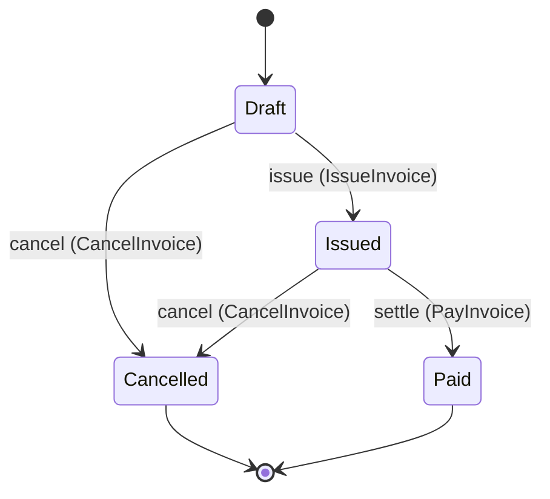

<!--
generated from billing v3
model digest 660af2b6d97ea480
compiler 0.1.0 · generator 0.1.0
do not edit: regenerate with `protocol ess generate`
-->

# Invoicing

Issuing invoices and tracking whether they are paid.

`billing.invoice` is one of billing's bounded contexts. [Back to the index](../README.md).

## Types

### `Channel`

`billing.invoice.Channel` is one of `Email`, `Post` and `Portal`.

Shown to a person as "Delivery channel".

### `CompanyRef`

`billing.invoice.CompanyRef` wraps `String` and is not interchangeable with one: the whole value of naming it separately is the crossings the model then refuses.

### `Email`

`billing.invoice.Email` wraps `String` and is not interchangeable with one: the whole value of naming it separately is the crossings the model then refuses.

### `InvoiceId`

`billing.invoice.InvoiceId` wraps `Uuid` and is not interchangeable with one: the whole value of naming it separately is the crossings the model then refuses.

### `LineItem`

`billing.invoice.LineItem` is a record of three fields:

- `description` — `String`
- `quantity` — `Integer`
- `unit_price` — `billing.invoice.Money`

### `Money`

`billing.invoice.Money` is a record of two fields:

- `amount` — `Decimal`
- `currency` — `String`

Every value satisfies `amount >= 0`.

### `Payee`

`billing.invoice.Payee` is one of two shapes, told apart by a `kind` field — tagged, so a decoder never has to guess which branch it is reading:

- `company` — `billing.invoice.CompanyRef`
- `person` — `billing.invoice.Email`

## Entities

An entity is what this context is about: something with an identity that outlives any one request, a shape, and a lifecycle. The lifecycle is exhaustive — a move that is not drawn below is a move this specification does not permit, and that is the only way it says so. Every move is labelled with the command that takes it, because a move nothing can trigger is refused rather than drawn.

### `Invoice`

`billing.invoice.Invoice`.

An instance is identified by `invoice_id`, a `billing.invoice.InvoiceId`. The name is part of the model and not a convention: a view projects the identity under that name, so a projection inventing its own would disagree with the view.

It holds:

- `total` — `billing.invoice.Money`
- `payee` — `billing.invoice.Payee`
- `channel` — `billing.invoice.Channel`
- `lines` — `List<billing.invoice.LineItem>`
- `note` — `Optional<String>`, which may be absent
- `metadata` — `Map<String, String>`
- `issued_at` — `Optional<Timestamp>`, which may be absent
- `settlement_window` — `Duration`
- `is_recurring` — `Boolean`
- `signature` — `Bytes`

Every instance satisfies `total.amount >= 0` — a predicate over this entity's own fields, checked against them rather than stored as a sentence, so an invariant reading something the entity does not have is refused instead of documented.

Its state is a `billing.invoice.Invoice.State`, one of `Cancelled`, `Draft`, `Issued` and `Paid`. That enum is synthesised from the lifecycle rather than declared beside it, so the states a view's filter compares and the states drawn below cannot disagree.

An instance is created in `Draft`. `Cancelled` and `Paid` are terminal, so an instance may rest there forever. That is declared rather than inferred from having no way out: an entity that cannot leave a state is either finished or stuck, and only its author knows which.

Each move is taken by a declared command outcome, and a move nothing takes is refused as `missing_causation` rather than left as a state change nobody can trigger:

- `issue` — taken by `billing.invoice.IssueInvoice` on its `issued` outcome
- `settle` — taken by `billing.invoice.PayInvoice` on its `settled` outcome
- `cancel` — taken by `billing.invoice.CancelInvoice` on its `cancelled` outcome

An instance is brought into existence by `billing.invoice.CreateInvoice` on its `accepted` outcome.

Illegal transitions are illegal by absence: no rule forbids them, there is simply no arrow, because a rule would be a second place for the same truth to live. A diagram cannot show an absence, so the pairs it does not connect are listed here, derived from the same transitions — anything named below is a move this specification does not permit.

- `Cancelled` may not become `Draft`
- `Cancelled` may not become `Issued`
- `Cancelled` may not become `Paid`
- `Draft` may not become `Paid`
- `Issued` may not become `Draft`
- `Paid` may not become `Cancelled`
- `Paid` may not become `Draft`
- `Paid` may not become `Issued`

Two views project it: [`InvoiceById`](#invoicebyid) and [`OutstandingInvoices`](#outstandinginvoices).

## Views

A view is what the outside world is promised it can observe. Each one says which instances it contains and how soon it reflects a command that has already returned, because "you can read this" without "how soon" is the promise every flaky suite is built on.

### `InvoiceById`

`billing.invoice.InvoiceById`.

It reads [`Invoice`](#invoice).

It contains every instance of that entity: no filter narrows it, which is a decision somebody made and not a line somebody omitted.

It exposes:

- `invoice_id` — `billing.invoice.InvoiceId`
- `total` — `billing.invoice.Money`

**Eventual**: it catches up some time after the command returns, so a caller that reads it immediately may legitimately not see its own write yet. Nothing here says how long that takes, so nothing here lets a caller wait a fixed time and call it correct.

A generated scenario therefore retries the assertion until the projection catches up, rather than asserting once and racing it. The repair everyone reaches for instead is a sleep, which turns the suite into a test of the machine it runs on.

### `OutstandingInvoices`

`billing.invoice.OutstandingInvoices`, shown to a person as "Outstanding invoices" and called `outstanding` on the wire.

It reads [`Invoice`](#invoice).

It contains the instances where `state == Issued` holds, and only those — so an instance a caller cannot find in here has been filtered out rather than lost.

It exposes:

- `invoice_id` — `billing.invoice.InvoiceId`
- `total` — `billing.invoice.Money`

**Read-your-writes**: it is current the moment the command that changed it returns. A caller that has just created an invoice and cannot see it in here has been told a lie about what it did.

A generated scenario asserts it once, immediately after the command: a view promising this and not keeping the promise has to fail the suite rather than be retried until it passes.

## Commands

### `CancelInvoice`

`billing.invoice.CancelInvoice`, shown to a person as "Cancel invoice" and called `cancel-invoice` on the wire.

It takes:

- `invoice_id` — `billing.invoice.InvoiceId`

It has one outcome.

**`cancelled`** — The invoice is cancelled, from Draft or from Issued. The default branch, taken when no other outcome's condition matched. It moves a `billing.invoice.Invoice` from `Draft` and `Issued` to `Cancelled`, along the declared move `cancel`. The instance is the one named by the input field `invoice_id`. It emits `billing.invoice.InvoiceCancelled`. A test reaches it by constructing an input that satisfies no other outcome's condition.

### `CreateInvoice`

`billing.invoice.CreateInvoice`, shown to a person as "Create invoice" and called `create-invoice` on the wire.

It takes:

- `customer_email` — `billing.invoice.Email`
- `amount` — `billing.invoice.Money`

It has two outcomes.

**`accepted`** — The invoice is created in Draft. Taken when `amount.amount > 0` holds of the input. It creates a `billing.invoice.Invoice`, which starts in `Draft`. The new instance's identity is published as `invoice_id` on `billing.invoice.InvoiceCreated`. It emits `billing.invoice.InvoiceCreated`. A test reaches it by constructing an input that satisfies that condition.

**`rejected`** — The amount was not positive, and nothing was created. The default branch, taken when no other outcome's condition matched. No entity in this specification changes. It reports `billing.invoice.InvalidAmount`, carrying `submitted`. It emits nothing. A test reaches it by constructing an input that satisfies no other outcome's condition.

### `IssueInvoice`

`billing.invoice.IssueInvoice`, shown to a person as "Issue invoice" and called `issue-invoice` on the wire.

It takes:

- `invoice_id` — `billing.invoice.InvoiceId`

It has one outcome.

**`issued`** — The invoice leaves Draft and is now Issued. The default branch, taken when no other outcome's condition matched. It moves a `billing.invoice.Invoice` from `Draft` to `Issued`, along the declared move `issue`. The instance is the one named by the input field `invoice_id`. It emits `billing.invoice.InvoiceIssued`. A test reaches it by constructing an input that satisfies no other outcome's condition.

### `PayInvoice`

`billing.invoice.PayInvoice`, shown to a person as "Pay invoice" and called `pay-invoice` on the wire.

It takes:

- `invoice_id` — `billing.invoice.InvoiceId`
- `amount` — `billing.invoice.Money`

It has two outcomes.

**`settled`** — The payment is accepted and the invoice becomes Paid. Taken when `amount.amount > 0` holds of the input. It moves a `billing.invoice.Invoice` from `Issued` to `Paid`, along the declared move `settle`. The instance is the one named by the input field `invoice_id`. It emits `billing.invoice.InvoicePaid`. A test reaches it by constructing an input that satisfies that condition.

**`rejected`** — The payment was not positive, so the invoice did not move. The default branch, taken when no other outcome's condition matched. No entity in this specification changes. It reports `billing.invoice.InvalidAmount`, carrying `submitted`. It emits nothing. A test reaches it by constructing an input that satisfies no other outcome's condition.

## Events

### `InvoiceCancelled`

`billing.invoice.InvoiceCancelled`.

It carries:

- `invoice_id` — `billing.invoice.InvoiceId`

Emitted by `billing.invoice.CancelInvoice` on its `cancelled` outcome.

Nothing in this system reacts to it.

### `InvoiceCreated`

`billing.invoice.InvoiceCreated`.

It carries:

- `invoice_id` — `billing.invoice.InvoiceId`
- `customer_email` — `billing.invoice.Email`
- `amount` — `billing.invoice.Money`

Emitted by `billing.invoice.CreateInvoice` on its `accepted` outcome.

`notify-on-invoice-created` reacts to it — see [Interactions](../interactions.md).

### `InvoiceIssued`

`billing.invoice.InvoiceIssued`.

It carries:

- `invoice_id` — `billing.invoice.InvoiceId`

Emitted by `billing.invoice.IssueInvoice` on its `issued` outcome.

Nothing in this system reacts to it.

### `InvoicePaid`

`billing.invoice.InvoicePaid`.

It carries:

- `invoice_id` — `billing.invoice.InvoiceId`
- `amount` — `billing.invoice.Money`

Emitted by `billing.invoice.PayInvoice` on its `settled` outcome.

Nothing in this system reacts to it.

## Errors

### `InvalidAmount`

The requested amount is not positive.

It carries:

- `submitted` — `billing.invoice.Money`

Reported by `billing.invoice.CreateInvoice` on its `rejected` outcome.

Reported by `billing.invoice.PayInvoice` on its `rejected` outcome.

## Actors

An actor is who may ask this context for something. Every grant below points at a command this specification declares — a grant is a resolved reference, so "may invoke" something nobody wrote is not a permission this model can express, and an authorisation that authorises nothing cannot ship quietly.

### `Auditor`

`billing.invoice.Auditor`.

It may invoke nothing: it observes. "Who is in this picture" is part of what a specification describes, so an actor with no grant is a statement rather than an unfinished line.

### `Customer`

`billing.invoice.Customer`, shown to a person as "Customer".

It may invoke [`CreateInvoice`](#createinvoice).

## Type crossings

Types in this context that the specification permits to be used as another type, or the other way round. Nothing else crosses: two newtypes over the same primitive stay distinct until a line in the specification says otherwise.

**`billing.invoice.Email` may be used as `billing.email.EmailAddress`**, because:

> An invoice's customer email is a deliverable address; the email context validates it again on the way out, so the invoice context does not have to know how.

Every crossing in the system is on one page: [Type crossings](../crossings.md).

---

Generated from billing v3 · model digest `660af2b6d97ea480` · compiler 0.1.0 · generator 0.1.0. Do not edit this file; change the specification and regenerate it with `protocol ess generate`.
