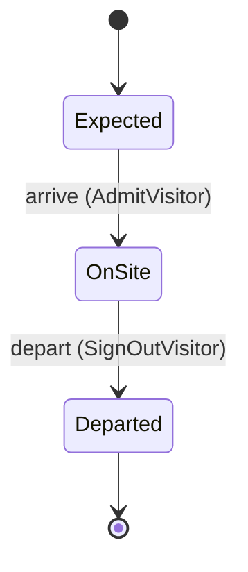

<!--
generated from gatepass v1
model digest f2e0f8ff51c077fa1c713d8151544379bafac36a5a927e71c685042d53ab6e61
contract digest e6e58e055d24f8f494dcff274f55e723d967f9d1f9aea16641bb8dacbb71171e
compiler 0.1.0 · generator 0.1.0
do not edit: regenerate with `protocol ess generate`
-->

# Visits

Expecting a visitor, letting them in, and letting them out again.

`gatepass.visit` is one of gatepass's bounded contexts. [Back to the index](../README.md).

## Types

### `Badge`

`gatepass.visit.Badge` is a record of three fields:

- `serial` — `String`
- `printed_at` — `Optional<Timestamp>`, which may be absent
- `signature` — `Bytes`

### `Building`

`gatepass.visit.Building` is one of `North`, `South` and `Annex`.

Shown to a person as "Building".

### `Deposit`

`gatepass.visit.Deposit` is a record of two fields:

- `amount` — `Decimal`
- `currency` — `String`

Every value satisfies `amount >= 0`.

### `EmployeeId`

`gatepass.visit.EmployeeId` wraps `String` and is not interchangeable with one: the whole value of naming it separately is the crossings the model then refuses.

### `Host`

`gatepass.visit.Host` is one of two shapes, told apart by a `kind` field — tagged, so a decoder never has to guess which branch it is reading:

- `contractor` — `gatepass.visit.VendorRef`
- `employee` — `gatepass.visit.EmployeeId`

### `VendorRef`

`gatepass.visit.VendorRef` wraps `String` and is not interchangeable with one: the whole value of naming it separately is the crossings the model then refuses.

### `VisitId`

`gatepass.visit.VisitId` wraps `Uuid` and is not interchangeable with one: the whole value of naming it separately is the crossings the model then refuses.

### `VisitorName`

`gatepass.visit.VisitorName` wraps `String` and is not interchangeable with one: the whole value of naming it separately is the crossings the model then refuses.

## Entities

An entity is what this context is about: something with an identity that outlives any one request, a shape, and a lifecycle. The lifecycle is exhaustive — a move that is not drawn below is a move this specification does not permit, and that is the only way it says so. Every move is labelled with the command that takes it, because a move nothing can trigger is refused rather than drawn.

### `Visit`

`gatepass.visit.Visit`.

An instance is identified by `visit_id`, a `gatepass.visit.VisitId`. The name is part of the model and not a convention: a view projects the identity under that name, so a projection inventing its own would disagree with the view.

It holds:

- `visitor` — `gatepass.visit.VisitorName`
- `building` — `gatepass.visit.Building`
- `host` — `gatepass.visit.Host`
- `expected_minutes` — `Integer`
- `expected_stay` — `Duration`
- `deposit` — `gatepass.visit.Deposit`
- `escorts` — `List<gatepass.visit.VisitorName>`
- `notes` — `Map<String, String>`
- `badge` — `Optional<gatepass.visit.Badge>`, which may be absent
- `on_watchlist` — `Boolean`

Every instance satisfies `deposit.amount >= 0` and `expected_minutes > 0` — a predicate over this entity's own fields, checked against them rather than stored as a sentence, so an invariant reading something the entity does not have is refused instead of documented.

Its state is a `gatepass.visit.Visit.State`, one of `Departed`, `Expected` and `OnSite`. That enum is synthesised from the lifecycle rather than declared beside it, so the states a view's filter compares and the states drawn below cannot disagree.

An instance is created in `Expected`. `Departed` is terminal, so an instance may rest there forever. That is declared rather than inferred from having no way out: an entity that cannot leave a state is either finished or stuck, and only its author knows which.

Each move is taken by a declared command outcome, and a move nothing takes is refused as `missing_causation` rather than left as a state change nobody can trigger:

- `arrive` — taken by `gatepass.visit.AdmitVisitor` on its `admitted` outcome
- `depart` — taken by `gatepass.visit.SignOutVisitor` on its `signed-out` outcome

An instance is brought into existence by `gatepass.visit.RegisterVisit` on its `registered` outcome.

Illegal transitions are illegal by absence: no rule forbids them, there is simply no arrow, because a rule would be a second place for the same truth to live. A diagram cannot show an absence, so the pairs it does not connect are listed here, derived from the same transitions — anything named below is a move this specification does not permit.

- `Departed` may not become `Expected`
- `Departed` may not become `OnSite`
- `Expected` may not become `Departed`
- `OnSite` may not become `Expected`

Two views project it: [`ExpectedVisits`](#expectedvisits) and [`VisitById`](#visitbyid).

## Views

A view is what the outside world is promised it can observe. Each one says which instances it contains and how soon it reflects a command that has already returned, because "you can read this" without "how soon" is the promise every flaky suite is built on.

### `ExpectedVisits`

`gatepass.visit.ExpectedVisits`, shown to a person as "Expected visits" and called `expected` on the wire.

It reads [`Visit`](#visit).

It contains the instances where `state == Expected` holds, and only those — so an instance a caller cannot find in here has been filtered out rather than lost.

It exposes:

- `visit_id` — `gatepass.visit.VisitId`
- `visitor` — `gatepass.visit.VisitorName`
- `building` — `gatepass.visit.Building`
- `deposit` — `gatepass.visit.Deposit`

**Read-your-writes**: it is current the moment the command that changed it returns. A caller that has just created an invoice and cannot see it in here has been told a lie about what it did.

A generated scenario asserts it once, immediately after the command: a view promising this and not keeping the promise has to fail the suite rather than be retried until it passes.

### `VisitById`

`gatepass.visit.VisitById`, shown to a person as "Visit by id" and called `by-id` on the wire.

It reads [`Visit`](#visit).

It contains every instance of that entity: no filter narrows it, which is a decision somebody made and not a line somebody omitted.

It exposes:

- `visit_id` — `gatepass.visit.VisitId`
- `visitor` — `gatepass.visit.VisitorName`
- `host` — `gatepass.visit.Host`
- `escorts` — `List<gatepass.visit.VisitorName>`
- `notes` — `Map<String, String>`
- `badge` — `Optional<gatepass.visit.Badge>`, which may be absent

**Eventual**: it catches up some time after the command returns, so a caller that reads it immediately may legitimately not see its own write yet. Nothing here says how long that takes, so nothing here lets a caller wait a fixed time and call it correct.

A generated scenario therefore retries the assertion until the projection catches up, rather than asserting once and racing it. The repair everyone reaches for instead is a sleep, which turns the suite into a test of the machine it runs on.

## Commands

### `AdmitVisitor`

`gatepass.visit.AdmitVisitor`, shown to a person as "Admit the visitor" and called `admit-visitor` on the wire.

It takes:

- `visit_id` — `gatepass.visit.VisitId`
- `badge` — `gatepass.visit.Badge`

It has two outcomes.

**`admitted`** — The visitor is on site, holding the badge that was printed. The default branch, taken when no other outcome's condition matched. It moves a `gatepass.visit.Visit` from `Expected` to `OnSite`, along the declared move `arrive`. The instance is the one named by the input field `visit_id`. It emits `gatepass.visit.VisitorAdmitted`. A test reaches it by constructing an input that satisfies no other outcome's condition.

**`wrong-state`** — The visit is not Expected, so nobody was admitted. Taken when the subject is resting in a state none of this command's moves start from — a `gatepass.visit.Visit` in `Departed` and `OnSite`, which is what is left of the lifecycle once this command's own moves are taken away. The document lists none of it. No entity in this specification changes. It reports `gatepass.visit.VisitStateConflict`, carrying `state`. It emits nothing. A test reaches it by driving an instance into one of those states and then issuing the command, because no input selects this branch.

### `RegisterVisit`

`gatepass.visit.RegisterVisit`, shown to a person as "Register a visit" and called `register-visit` on the wire.

It takes:

- `visitor` — `gatepass.visit.VisitorName`
- `building` — `gatepass.visit.Building`
- `host` — `gatepass.visit.Host`
- `expected_minutes` — `Integer`
- `expected_stay` — `Duration`
- `deposit` — `gatepass.visit.Deposit`
- `escorts` — `List<gatepass.visit.VisitorName>`
- `notes` — `Map<String, String>`
- `on_watchlist` — `Boolean`

It has two outcomes.

**`registered`** — The visit is recorded, and the visitor is Expected. Taken when `expected_minutes > 0` holds of the input. It creates a `gatepass.visit.Visit`, which starts in `Expected`. The new instance's identity is published as `visit_id` on `gatepass.visit.VisitRegistered`. It emits `gatepass.visit.VisitRegistered`. A test reaches it by constructing an input that satisfies that condition.

**`refused`** — The expected length was not positive, and nothing was recorded. The default branch, taken when no other outcome's condition matched. No entity in this specification changes. It reports `gatepass.visit.InvalidVisitLength`, carrying `submitted`. It emits nothing. A test reaches it by constructing an input that satisfies no other outcome's condition.

### `SignOutVisitor`

`gatepass.visit.SignOutVisitor`, shown to a person as "Sign the visitor out" and called `sign-out-visitor` on the wire.

It takes:

- `visit_id` — `gatepass.visit.VisitId`

It has two outcomes.

**`signed-out`** — The visitor has left the building. The default branch, taken when no other outcome's condition matched. It moves a `gatepass.visit.Visit` from `OnSite` to `Departed`, along the declared move `depart`. The instance is the one named by the input field `visit_id`. It emits `gatepass.visit.VisitorDeparted`. A test reaches it by constructing an input that satisfies no other outcome's condition.

**`wrong-state`** — The visit is not OnSite, so nobody was signed out. Taken when the subject is resting in a state none of this command's moves start from — a `gatepass.visit.Visit` in `Departed` and `Expected`, which is what is left of the lifecycle once this command's own moves are taken away. The document lists none of it. No entity in this specification changes. It reports `gatepass.visit.VisitStateConflict`, carrying `state`. It emits nothing. A test reaches it by driving an instance into one of those states and then issuing the command, because no input selects this branch.

## Events

### `VisitRegistered`

`gatepass.visit.VisitRegistered`.

It carries:

- `visit_id` — `gatepass.visit.VisitId`
- `visitor` — `gatepass.visit.VisitorName`
- `building` — `gatepass.visit.Building`

Emitted by `gatepass.visit.RegisterVisit` on its `registered` outcome.

Nothing in this system reacts to it.

### `VisitorAdmitted`

`gatepass.visit.VisitorAdmitted`.

It carries:

- `visit_id` — `gatepass.visit.VisitId`
- `badge` — `gatepass.visit.Badge`

Emitted by `gatepass.visit.AdmitVisitor` on its `admitted` outcome.

Nothing in this system reacts to it.

### `VisitorDeparted`

`gatepass.visit.VisitorDeparted`.

It carries:

- `visit_id` — `gatepass.visit.VisitId`

Emitted by `gatepass.visit.SignOutVisitor` on its `signed-out` outcome.

Nothing in this system reacts to it.

## Errors

### `InvalidVisitLength`

The expected length of the visit is not a positive number of minutes.

It carries:

- `submitted` — `Integer`

Reported by `gatepass.visit.RegisterVisit` on its `refused` outcome.

### `VisitStateConflict`

The visit is not in a state this command acts from, so nothing moved.

It carries:

- `state` — `gatepass.visit.Visit.State`

Reported by `gatepass.visit.AdmitVisitor` on its `wrong-state` outcome.

Reported by `gatepass.visit.SignOutVisitor` on its `wrong-state` outcome.

## Actors

An actor is who may ask this context for something. Every grant below points at a command this specification declares — a grant is a resolved reference, so "may invoke" something nobody wrote is not a permission this model can express, and an authorisation that authorises nothing cannot ship quietly.

### `Receptionist`

`gatepass.visit.Receptionist`, shown to a person as "Receptionist".

It may invoke [`AdmitVisitor`](#admitvisitor), [`RegisterVisit`](#registervisit) and [`SignOutVisitor`](#signoutvisitor).

### `SecurityAuditor`

`gatepass.visit.SecurityAuditor`, shown to a person as "Security auditor".

It may invoke nothing: it observes. "Who is in this picture" is part of what a specification describes, so an actor with no grant is a statement rather than an unfinished line.

---

Generated from gatepass v1 · model digest `f2e0f8ff51c077fa1c713d8151544379bafac36a5a927e71c685042d53ab6e61` · compiler 0.1.0 · generator 0.1.0. Do not edit this file; change the specification and regenerate it with `protocol ess generate`.
