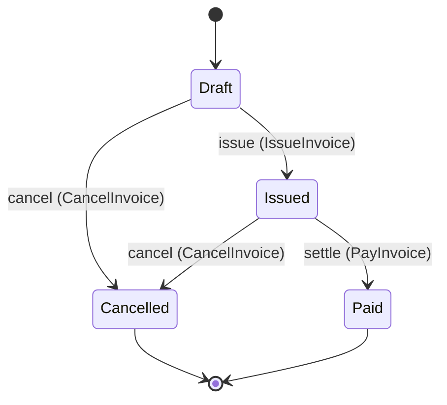

import LabLaunch from '@site/src/components/LabLaunch';

# A specification and its contracts

This page shows the central claim on real files: the specification is not a document *beside* the
contracts — it is what the contracts are derived from. Everything below is copied out of the
repository: the source from `examples/billing/`, the output from `generated/`, kept in step by
`cargo xtask generate --check` in CI.

## The source

<LabLaunch />

What the lab runs is this specification, executing in your browser. It fetches
`billing_web_realized.wasm` — the module `protocol ess synthesize --target web` emits from
`examples/billing/`, linked with the hand-written behaviour in `examples/billing-realization/` and
built for `wasm32-unknown-unknown` — and sends five commands over its boundary: one accepted, two
declared moves, one move the lifecycle does not have, and one refusal a guard decides. That is every
way this model can answer. The outcomes, the log, the binding invocations and the view rows are what
came back; the middle panel is the compiler's own model, asked for out of the same module. Nothing
on the page is a recording of an earlier run.

Three values are chosen rather than derived: an email address and two amounts. A specification
declares types and not instances, so somebody has to pick an input. Everything the run then says
about them came back over the module's boundary. Identifiers come from a counter inside the module
rather than from a clock, so the same script produces a byte-identical stream of steps on every
load, and `website/src/pages/lab/_run.test.mjs` holds it there.

One command, from `examples/billing/domains/invoice.yaml`:

```yaml
commands:
  - name: billing.invoice.CreateInvoice

    naming:
      wire: create-invoice
      display: Create invoice

    input:
      - name: customer_email
        type: billing.invoice.Email
      - name: amount
        type: billing.invoice.Money

    # Two outcomes, because this command can be refused. A specification that
    # recorded only the first would generate a suite that never checks what
    # happens when the amount is wrong.
    outcomes:
      - name: accepted
        when: amount.amount > 0
        creates: billing.invoice.Invoice
        # `creates:` is the one verb whose instance the caller cannot name —
        # the id is the implementation's to assign — so `instance:` names the
        # emitted-event field the new identity is published in.
        instance: invoice_id
        emits:
          - billing.invoice.InvoiceCreated
        # Where the announced fact's values come from. Without this block the event's
        # *types* are declared and its *values* are not, so an implementation
        # announcing an amount nobody submitted contradicts nothing. `invoice_id` has
        # no line on purpose: the identity is the implementation's to assign.
        payload:
          billing.invoice.InvoiceCreated:
            customer_email: input.customer_email
            amount: input.amount
        summary: The invoice is created in Draft.

      - name: rejected
        error: billing.invoice.InvalidAmount
        summary: The amount was not positive, and nothing was created.
```

`Money` and `Email` are declared in the same file — `Money` a struct with the invariant
`amount >= 0`, `Email` a newtype over `String` that is deliberately not interchangeable with one.

## JSON Schema

`generated/schema/commands/billing.invoice.CreateInvoice.schema.json`, in full:

```json
{
  "$schema": "https://json-schema.org/draft/2020-12/schema",
  "title": "Create invoice input",
  "x-ess-name": "billing.invoice.CreateInvoice",
  "x-ess-kind": "command-input",
  "type": "object",
  "properties": {
    "customer_email": {
      "$ref": "#/$defs/billing.invoice.Email"
    },
    "amount": {
      "$ref": "#/$defs/billing.invoice.Money"
    }
  },
  "required": [
    "customer_email",
    "amount"
  ],
  "additionalProperties": false,
  "x-ess-provenance": {
    "system": "billing",
    "specification_version": "v3",
    "source_digest": "13577b3ce695932e980d418d5863bcde07f4c362516d53147870d31eaf2ed861",
    "contract_digest": "e5df34917bf15c4fee175ec02ada20cff4b051b548c7d1da47ff37d85a743822",
    "compiler_version": "0.1.0",
    "generator_version": "0.1.0",
    "regenerate": "protocol ess generate"
  },
  "$defs": {
    "billing.invoice.Email": {
      "title": "Email",
      "x-ess-name": "billing.invoice.Email",
      "x-ess-kind": "newtype",
      "type": "string"
    },
    "billing.invoice.Money": {
      "title": "Money",
      "x-ess-name": "billing.invoice.Money",
      "x-ess-kind": "struct",
      "type": "object",
      "properties": {
        "amount": {
          "type": "string",
          "format": "decimal",
          "pattern": "^-?(0|[1-9][0-9]*)(\\.[0-9]+)?$"
        },
        "currency": {
          "type": "string"
        }
      },
      "required": [
        "amount",
        "currency"
      ],
      "additionalProperties": false,
      "x-ess-invariants": [
        "amount >= 0"
      ]
    }
  }
}
```

Three things to notice. The newtype survived as its own definition rather than collapsing into
`string`. The struct's invariant travelled with it as `x-ess-invariants`. And the provenance block
carries two digests, not one: `source_digest` is the whole model this file was generated from, and
`contract_digest` is the digest of the *slice* it actually derives from — the seed constructs closed
over everything they rest on.

The second digest is what stops a one-word change costing a full regeneration. When the
specification moves, `protocol ess impact` compares each artifact's committed `contract_digest`
against the digest its slice computes, and names only the artifacts whose slice actually moved.
Without it, every change owes the whole generated tree.

## OpenAPI 3.1

`generated/openapi/invoice-service.yaml`, the path for the same command:

```yaml
  /invoices/commands/create-invoice:
    post:
      operationId: billing.invoice.CreateInvoice
      summary: Create invoice
      tags:
      - invoices
      x-ess-may-invoke:
      - billing.invoice.Customer
      requestBody:
        description: The input `billing.invoice.CreateInvoice` declares.
        required: true
        content:
          application/json:
            schema:
              $ref: '#/components/schemas/billing.invoice.CreateInvoice.Input'
      responses:
        '202':
          description: 'Outcome `accepted`: the branch the specification declares for this input. Events this branch emits are published to consumers, not returned here.'
          content:
            application/json:
              schema:
                $ref: '#/components/schemas/billing.invoice.CreateInvoice.accepted.Response'
        '422':
          description: 'Outcome `rejected`: the request was understood and refused on domain grounds. The body names the declared error and carries whatever that error declares.'
          content:
            application/json:
              schema:
                $ref: '#/components/schemas/billing.invoice.CreateInvoice.rejected.Response'
```

The two outcomes became two status codes, and `x-ess-may-invoke` comes from the actor declaration in
the model — not from an annotation someone added to the HTTP layer. The file's own header records
the provenance and the regeneration command.

## AsyncAPI 3.0

`generated/asyncapi/invoice-service.yaml` describes what the component publishes, and says plainly
what the model does not know:

```text
The specification declares no transport, so each address below is a name and not a topic on a named
broker. Servers, protocol bindings, security schemes, message keys, partitioning, retention and
ordering are absent because the model does not state them.
```

A generator that invented a broker here would be inventing a decision nobody made.

## Documentation

`generated/docs/domains/billing.invoice.md` renders the entity lifecycle from the declared
transitions:



Then it does something a diagram cannot: it lists the absences. Illegal transitions are illegal
because no arrow exists — there is no second, forbidding rule to fall out of date — and since a
diagram cannot show an absence, the unconnected pairs are listed, derived from the same transitions:

> * `Cancelled` may not become `Draft`
> * `Draft` may not become `Paid`
> * `Paid` may not become `Cancelled`
> * … (all eight pairs)

The same page renders the cross-context binding as a flowchart — the event, the command it invokes,
its outcomes, and the escalation event that makes the failure path observable at all.

## What is not generated

Behaviour. The specification also generates its own conformance suite and the structural part of its
implementation in three targets — but every algorithm remains a typed obligation someone implements.
See [Synthesize code from a specification](../guides/synthesize.md) and
[Limitations](../status/limitations.md).

---

**Sources.** `examples/billing/domains/invoice.yaml`;
`generated/schema/commands/billing.invoice.CreateInvoice.schema.json`;
`generated/openapi/invoice-service.yaml`; `generated/asyncapi/invoice-service.yaml`;
`generated/docs/domains/billing.invoice.md`; `Taskfile.yml` (`generate-check`, and `lab`, which
builds the module the lab runs and holds its output to `website/src/pages/lab/_run.test.mjs`).
