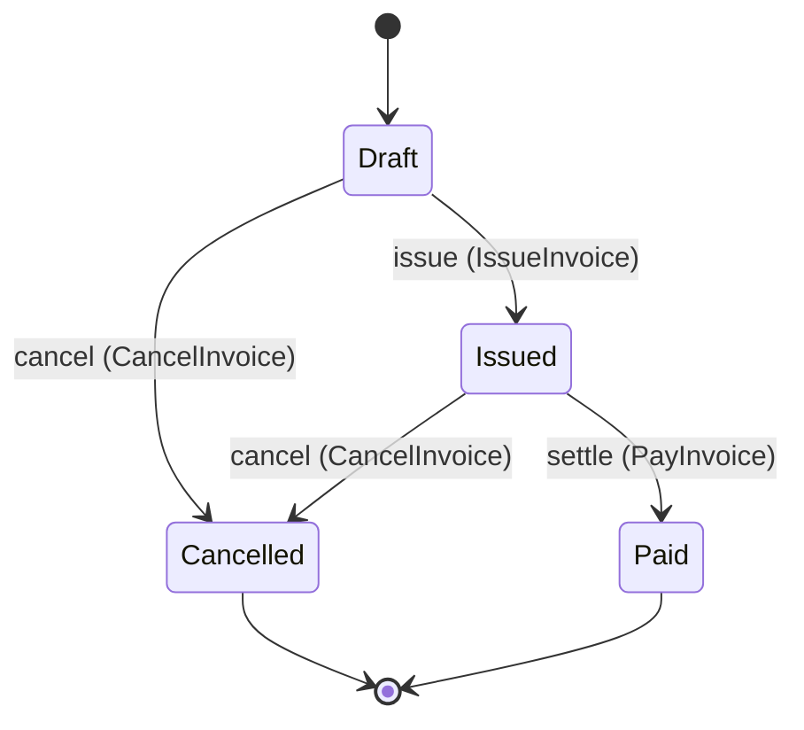
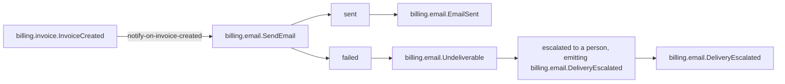

# A specification and its contracts

This is the project's central claim on one page: the specification is not a document *beside* the
contracts, it is the thing the contracts are derived from.

Everything below is copied out of the repository. The left-hand side lives in `examples/billing/`,
the normative example. The right-hand side lives in `generated/`, is produced by
`protocol ess generate`, and is checked in CI — `cargo xtask generate --check` fails if the committed
output no longer matches the specification.

## The source

One command, from `examples/billing/domains/invoice.yaml`:

```yaml
commands:
  - name: billing.invoice.CreateInvoice

    naming:
      wire: create-invoice
      display: Create invoice

    input:
      - name: customer_email
        type: billing.invoice.Email
      - name: amount
        type: billing.invoice.Money

    # Two outcomes, because this command can be refused. A specification that recorded only the
    # first would generate a suite that never checks what happens when the amount is wrong.
    outcomes:
      - name: accepted
        when: amount.amount > 0
        creates: billing.invoice.Invoice
        emits:
          - billing.invoice.InvoiceCreated
        summary: The invoice is created in Draft.

      - name: rejected
        error: billing.invoice.InvalidAmount
        summary: The amount was not positive, and nothing was created.
```

A command with a precondition has at least two results. The branch where the money does not move is
the one that matters, so the model has no way to write only the happy one: `outcomes:` is the
vocabulary, not an `emits:` list.

`Money` and `Email` are declared in the same file — `Money` a struct with the invariant
`amount >= 0`, `Email` a newtype over `String` that is deliberately not interchangeable with one.

## What it compiled into

### JSON Schema

`generated/schema/commands/billing.invoice.CreateInvoice.schema.json`, in full:

```json
{
  "$schema": "https://json-schema.org/draft/2020-12/schema",
  "title": "Create invoice input",
  "x-ess-name": "billing.invoice.CreateInvoice",
  "x-ess-kind": "command-input",
  "type": "object",
  "properties": {
    "customer_email": {
      "$ref": "#/$defs/billing.invoice.Email"
    },
    "amount": {
      "$ref": "#/$defs/billing.invoice.Money"
    }
  },
  "required": [
    "customer_email",
    "amount"
  ],
  "additionalProperties": false,
  "x-ess-provenance": {
    "system": "billing",
    "specification_version": "v3",
    "source_digest": "2940fd167bf4c4cc",
    "compiler_version": "0.1.0",
    "generator_version": "0.1.0",
    "regenerate": "protocol ess generate"
  },
  "$defs": {
    "billing.invoice.Email": {
      "title": "Email",
      "x-ess-name": "billing.invoice.Email",
      "x-ess-kind": "newtype",
      "type": "string"
    },
    "billing.invoice.Money": {
      "title": "Money",
      "x-ess-name": "billing.invoice.Money",
      "x-ess-kind": "struct",
      "type": "object",
      "properties": {
        "amount": {
          "type": "string",
          "format": "decimal",
          "pattern": "^-?(0|[1-9][0-9]*)(\\.[0-9]+)?$"
        },
        "currency": {
          "type": "string"
        }
      },
      "required": [
        "amount",
        "currency"
      ],
      "additionalProperties": false,
      "x-ess-invariants": [
        "amount >= 0"
      ]
    }
  }
}
```

Three things to notice. The newtype survived as its own definition rather than collapsing into
`string`. The struct's invariant travelled with it as `x-ess-invariants`. And the provenance block
names the model digest that produced the file, so an artifact can always say which specification it
came from.

### OpenAPI 3.1

`generated/openapi/invoice-service.yaml`, the path for the same command:

```yaml
  /invoices/commands/create-invoice:
    post:
      operationId: billing.invoice.CreateInvoice
      summary: Create invoice
      tags:
      - invoices
      x-ess-may-invoke:
      - billing.invoice.Customer
      requestBody:
        description: The input `billing.invoice.CreateInvoice` declares.
        required: true
        content:
          application/json:
            schema:
              $ref: '#/components/schemas/billing.invoice.CreateInvoice.Input'
      responses:
        '202':
          description: 'Outcome `accepted`: the branch the specification declares for this input. Events this branch emits are published to consumers, not returned here.'
          content:
            application/json:
              schema:
                $ref: '#/components/schemas/billing.invoice.CreateInvoice.accepted.Response'
        '422':
          description: 'Outcome `rejected`: the request was understood and refused on domain grounds. The body names the declared error and carries whatever that error declares.'
          content:
            application/json:
              schema:
                $ref: '#/components/schemas/billing.invoice.CreateInvoice.rejected.Response'
```

The two outcomes became two status codes. `x-ess-may-invoke` is there because the specification says
`billing.invoice.Customer` may invoke this command — an actor in the model, not an annotation
someone added to the HTTP layer. The file's own header states the rule it followed:

```text
# generated from billing v3
# model digest 2940fd167bf4c4cc
# compiler 0.1.0 · generator 0.1.0
# do not edit: regenerate with `protocol ess generate`
```

### AsyncAPI 3.0

`generated/asyncapi/invoice-service.yaml` describes what the same component publishes, and says
plainly what the model does not know:

```yaml
    The specification declares no transport, so each address below is a name and not a topic on a named broker. Servers, protocol bindings, security schemes, message keys, partitioning, retention and ordering are absent because the model does not state them.
```

A generator that invented a broker here would be inventing a decision nobody made.

### Documentation

`generated/docs/domains/billing.invoice.md` renders the entity's lifecycle, and the diagram is
derived from the same transitions:



It also renders the interaction between the two contexts as a flowchart — the binding, the outcomes
it can reach, and what happens when it fails:



The rightmost pair is the part worth pausing on. Surfacing a failure to a person happens *outside*
the system, so a specification that said only "escalate" would be describing something no test could
ever observe. The model therefore requires the escalation to name an event, and that event —
`billing.email.DeliveryEscalated` — is the only way a reader, a generated test or a conformance
target can tell the escalation happened at all.

Then it does something a diagram cannot, and lists the absences:

> Illegal transitions are illegal by absence: no rule forbids them, there is simply no arrow, because
> a rule would be a second place for the same truth to live. A diagram cannot show an absence, so the
> pairs it does not connect are listed here, derived from the same transitions — anything named below
> is a move this specification does not permit.
>
> - `Cancelled` may not become `Draft`
> - `Cancelled` may not become `Issued`
> - `Cancelled` may not become `Paid`
> - `Draft` may not become `Paid`
> - `Issued` may not become `Draft`
> - `Paid` may not become `Cancelled`
> - `Paid` may not become `Draft`
> - `Paid` may not become `Issued`

`Paid` cannot become `Cancelled` because no transition says it can. There is no rule forbidding it,
and that is the design: a rule would be a second place for the same truth to live, and two places
eventually disagree.

## What comes out, per projection

| `--kind` | output for `examples/billing/` | why it exists |
|---|---|---|
| `docs` | six Markdown pages with diagrams | the cheapest check that the model is complete: a construct with no rendering is a hole in a page a person reads |
| `schema` | one JSON Schema per command input, event and error payload, plus the named types | the type system, projected without losing the distinctions it exists to make |
| `openapi` | one OpenAPI 3.1 document per component — two here | the specification *is* the HTTP contract, not a document beside it |
| `asyncapi` | one AsyncAPI 3.0 document per component — two here | the same for messaging, including what happens when a binding fails |

## Two things a projection can quietly destroy

Stated because they are the questions to ask of any generated artifact, including these.

**A newtype collapsing into its representation.** `billing.invoice.Email` and
`billing.email.EmailAddress` are both a `String` underneath. The generated schemas keep them as
separate definitions with separate references, so a code generator emits two types — but on the wire
both are a bare JSON string, and **a payload with the two values swapped validates clean.** JSON
Schema constrains structure; it cannot carry nominal identity. That is a real limit, stated rather
than papered over.

**A command becoming an endpoint.** The model has no `exposures:` construct yet, so
`/invoices/commands/create-invoice` is a *convention the generator chose* — written down in the
generated document's own description rather than left for a reader to infer.

## What is not generated

No tests, and no code. A generated conformance suite is ESS wave 4; Rust structural synthesis is
wave 5. Neither has started. The generated OpenAPI and AsyncAPI *envelopes* are checked structurally
rather than against the OpenAPI 3.1 and AsyncAPI 3.0 meta-schemas — every schema those documents
embed is validated against the real JSON Schema 2020-12 meta-schema, so what is unchecked is the
envelope, not the types.

---

**Sources.** `examples/billing/domains/invoice.yaml`;
`generated/schema/commands/billing.invoice.CreateInvoice.schema.json`;
`generated/openapi/invoice-service.yaml`; `generated/asyncapi/invoice-service.yaml`;
`generated/docs/domains/billing.invoice.md`; `docs/guide/specification.md`; `README.md` § *What does
not work yet*; `Taskfile.yml` (`generate-check`).
